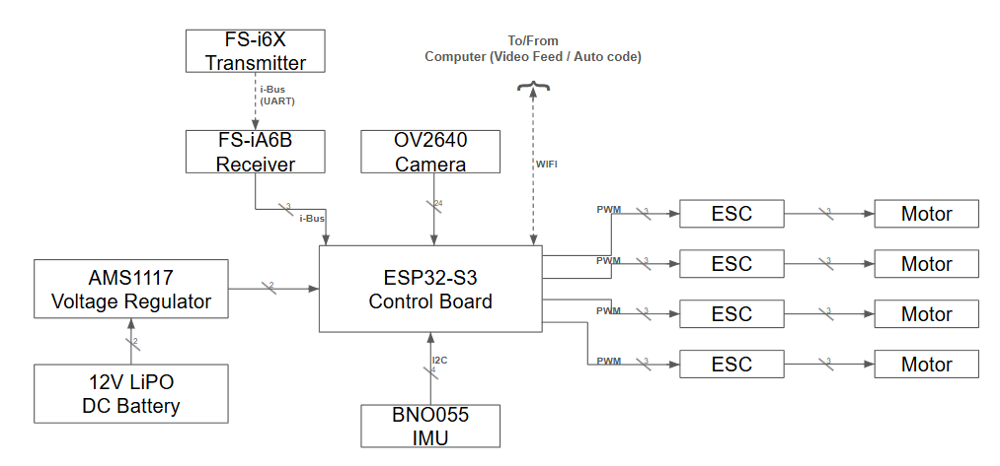

# Droneanator 9000

The "Droneanator 9000" is an autonomous unmanned aerial vehicle (UAV). It will aid remote communities worldwide through long-range autonomous supply missions, improving quality of life for those living in these communities. Our clients will include disaster relief agencies, charity organisations, government agencies, etc. See the HRS document for more information.

## IDE

This project uses the PlatformIO extension in VSCode.

## Libraries

| **Name** | **Link**                                    |
| -------- | ------------------------------------------- |
| IBusBM   | https://github.com/bmellink/IBusBM          |
| BNO055   | https://github.com/adafruit/Adafruit_BNO055 |
